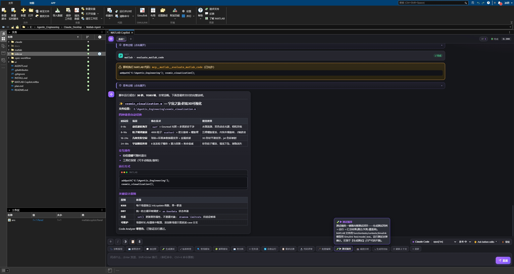
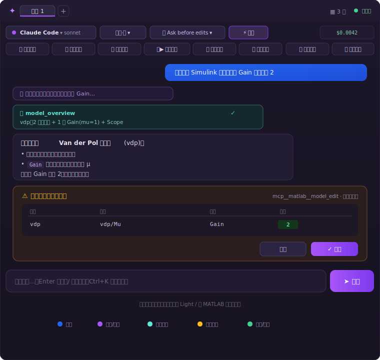

<div align="center">

# 🛰️ MATLAB / Simulink Copilot — 内嵌侧边栏

**像 VS Code 侧栏插件那样，真正内嵌进 MATLAB / Simulink 界面的 AI 助手。**

停靠面板里对话 · 自动感知当前文件 / 模型 / 选中 block / 工作区 / 报错 · 通过官方 MATLAB MCP 操作实况会话。
无第二个窗口、无外部浏览器。


</div>

<div align="center">
  
  <br>
  <sub>📷 真实运行截图：MATLAB R2025b 桌面内停靠的 Copilot 面板 · 工具调用卡 · 富文本表格回答 · 整排快捷动作 · Claude Code / opus 工具栏</sub>
</div>

<div align="center">
  <br>
  
  <br>
  <sub>🎨 界面元素图解（标注示意）：用户气泡 / 助手·思考 / 工具调用 / 权限确认 / 成本状态的配色与布局</sub>
</div>

---

## 📌 这是什么

官方 **MATLAB Copilot / Simulink Copilot** 在中国无法使用。本项目自研一套同类工具，核心价值是 **「原生内嵌的 UI 外壳 + 把已跑通的 agent 能力搬进 MATLAB 界面」**，并做到能力**只多不少**：

- 🧠 **大脑** = 你自己的 **Claude Code** 或 **Codex** CLI（绑定你的账号/订阅，可运行时切换）
- ✋ **手** = 复用官方 **MATLAB MCP Server**（读写你的实况模型与工作区）
- 🪟 **外壳**（本项目）= 进程内原生可停靠面板 + 上下文感知 + 权限确认 + 流式渲染

> 💡 **为什么自研有意义**：官方产品在中国不可用，而「操作 MATLAB 的手」（MCP）和「agent 大脑」（Claude/Codex）都已现成。本项目把它们**接进 MATLAB 自己的界面**，并补齐了 MBD 工程化、会话持久化、双后端切换等官方没有的能力。

---

## 🏗️ 系统架构

一句话：**面板 = MATLAB 进程内原生 UI；干活 = 本地 sidecar 驱动的 headless 后端；操作 MATLAB 的手 = 复用已有 MATLAB MCP；MATLAB 自身充当 UI ↔ 上下文 ↔ sidecar 的中继。**

<div align="center">
  
</div>

| 层 | 职责 | 技术 |
|---|---|---|
| **① MATLAB / Simulink 界面** | 可停靠面板、上下文采集、工程索引、会话持久化 | `uifigure` + `uihtml`，进程内原生 |
| **② 本地 Node sidecar** | 后端适配、流式翻译、权限路由、能力枚举、审计 | 零 npm 依赖，行分隔 JSON over TCP |
| **③ AI 后端 + MATLAB MCP** | 推理与生成；读写实况模型/工作区 | Claude Code / Codex；matlab-mcp-server |

---

## 🔄 一轮对话的数据流

<div align="center">
  
</div>

- **线上全 ASCII**：MATLAB `tcpclient` 会错解码 UTF-8，故 JSON 一律 `\uXXXX` 转义。
- **常驻 / 每轮可选**：Claude Code 支持常驻进程模式（⚡ 开关）消除每轮冷启；默认走可靠的 resume 模式。
- **权限旁路**：破坏性操作经独立控制端口转成 UI 确认卡（见下方安全模型）。

---

## ✨ 功能全景

<div align="center">
  
</div>

### 🆕 v0.7.0 新增：边读边问 · 边答边干预

长回答看到一半想追问某一句？答到一半想补需求或叫停？这两个场景在 v0.7.0 被打通——**全部真实运行截图**：

<table>
<tr>
<td width="50%" valign="top">
  
  <br>
  <sub><b>📝 选区批注</b>：在助手回答里<b>选中有疑问的文字 → 右键</b>，就地弹出批注框（标题锚定你选的那段）。</sub>
</td>
<td width="50%" valign="top">
  
  <br>
  <sub><b>🟡 高亮 + 🗒 便签 + ⏸ 队列 + ⌨ Esc</b>：被批注段落<b>持久黄色高亮</b>；多条追问以<b>便签卡片</b>贴在发送区一起发；回答中插入的新指令在<b>右下角灰显排队</b>；红色 <b>停止</b> 按钮 / <b>Esc</b> 即时中断本轮。</sub>
</td>
</tr>
</table>

- **📝 选区批注 / 便签追问**：右键选中 → 批注框 → 多段连续批注汇总成一条发送；每条便签锚定原文，AI 清楚你针对哪几处；批注状态按标签页隔离不串台。
- **⏸ 回答中插入新指令**：**队列**模式排队、上一轮结束逐条自动发（右下角灰显回显）；**引导**模式立即抢占、优先执行新指令。
- **⌨ Esc 即时中断**：回答中按 `Esc`（或点 **Stop**）立即停下本轮。

### 🎯 对标官方 Simulink Copilot（6 项能力 + 可追溯 + 任务编排，已全部对齐或超过）

| 官方能力 | 本项目 | 实现 |
|---|---|---|
| 对话（工具/建模/设计建议） | ✅ | 双后端，运行时切换 |
| 解释模型 / 模块 | ✅ 🧩 | 选中 block → `model_read` 读真实参数逐个精准解释 |
| 搜索模型组件 | ✅ 🔍 | 描述 → 语义定位 → `hilite_system` 画布橙色高亮 |
| 排查错误 | ✅ 🩺 | `sldiagviewer.DiagnosticReceiver` 结构化诊断 + 卡片 + **一键跳转到出错 block** |
| 答案锚定 MathWorks 文档 | ✅ 📖 | 在线 RAG（WebFetch 抓官方文档核实）+ 本地 `help` 兜底 + 未核实标注 |
| 可信度 / 可追溯（认证级） | ✅ 🛡 | 破坏性操作审计 JSONL + 改后 `model_read` 回读验证 + 来源标注 |
| 自动执行预定义任务（Process Advisor） | ✅ ⚙ | 自适应任务流：探测能力，有 padv 用真的、无则等价管线兜底 |

> **额外更强**：在中国可用 · R2025b 可用 · 双后端运行时切换 · 思考/工具可视化 · 多页面 + Fork · 主题三选。
> **故意不做**编辑器内灰字补全（MATLAB 无公开补全 API），以 **↳ 生成到光标** 替代。

### 🔧 MBD 工程化（面向汽车 / 嵌入式 / 认证）

| 功能 | 说明 |
|---|---|
| 🪄 **批量编辑** | 自然语言描述批改（「给所有 Outport 加日志」）→ 定位**所有**目标 block → 逐个 `model_edit`，**每处仍弹 diff 确认** |
| 🧪▶ **测试编排** | 生成测试 → 运行 → 结果汇总闭环（functiontests/runtests 或 Simulink Test） |
| 📋 **需求追溯** | 反向推导需求条目、建立 block ↔ 需求双向追溯矩阵（检测 Requirements Toolbox） |
| 🔬 **代码评审** | MISRA-C 风险 + McCabe 复杂度 + 向量化机会 + Embedded Coder 代码规模/RAM/ROM 估算 |
| 🔄 **自愈验证环** | run → 抓错 → 修 → 重跑，最多 3 轮直到通过，每轮标注 `[验证 N/3]` |
| 📸 **画布截图分析** | 导出模型 PNG → 视觉分析信号流/命名/未连接端口/布局 |

### 💬 会话与平台能力

| 功能 | 说明 |
|---|---|
| 🔀 双后端运行时切换 | Claude Code ↔ Codex，会话/线程各自 resume |
| ⚡ Claude 常驻进程 | 进程常驻、每轮免冷启；故障自动 resume 重启（opt-in 开关） |
| 🗂 多标签 + 卡片 Fork | 每标签独立对话/后端/配置；任一回答可 Fork 出独立子会话 |
| 📝 选区批注 + 便签追问 | 右键选中回答里的文字 → 批注框 → 多条便签汇总一键发；被批注段落持久黄色高亮 |
| ⏸ 回答中插入 + Esc 中断 | 答复时插入新指令（**队列**排队 / **引导**立即抢占）；`Esc` 即时中断本轮 |
| 💾 会话持久化 + 按项目恢复 | 历史按工程根落盘，重启自动恢复 |
| ⬇ 导出 Markdown · 💰 成本/token 显示 · ☑ 任务清单可视化 · ⌨ Ctrl+K 命令面板 | — |
| 📁 工程级全工程索引 | git 分支/状态 + slx/m/数据字典/Bus 文件清单 |
| 🎨 主题三选 | Light / Dark / 随 MATLAB 自动切换 |

---

## 🔐 权限与安全模型

**绝不使用 `--dangerously-skip-permissions`。** 每个工具调用都过这套门控。

<div align="center">
  
</div>

- **只读工具** + **只读文档自省**（`help`/`which`/`exist`/`lookfor` 单条）→ 自动放行。
- **破坏性工具**（`model_edit`/`run_matlab_file`/`evaluate_matlab_code`/`model_test`）→ 按编辑模式判定：
  - **Ask**（默认）逐条弹确认卡（带 diff 预览）；
  - **Auto** 改模型/写文件放行，但**运行代码/跑测试仍需确认**；
  - **Plan** 破坏性工具一律拒绝（sidecar 强制，不靠 LLM 自觉）。
- **兜底**：面板未连接默认拒绝 · 确认 180s 超时默认拒绝 · 自动放行严格门控（多代码字段不放行）· 全程审计留痕。

---

## 🚀 快速开始

> 完整步骤、验证方法、FAQ 见 **[INSTALL.md](INSTALL.md)**；版本变更见 **[CHANGELOG.md](CHANGELOG.md)**（当前 **v0.7.0**）。

```matlab
% 1. 安装工具箱(双击 .mltbx 或)
matlab.addons.install('MATLAB-Copilot.mltbx')

% 2. (终端)装并登录后端 CLI
%    npm i -g @anthropic-ai/claude-code && claude login

% 3. 装 Simulink Agentic Toolkit(附加功能),然后共享会话
satk_initialize

% 4. 环境自检
copilot_doctor()

% 5. 启动(面板停靠在 MATLAB 界面内)
copilot
```

打开模型后试：「解释当前模型」（出工具卡）、「把某 Gain 改成 2」（出确认卡）、点 🩺 诊断报错。

| 前置条件 | 要求 |
|---|---|
| MATLAB | R2023b+（含 Simulink，推荐 R2025b） |
| Node.js | ≥ 20 LTS（**sidecar 零 npm 依赖，无需 `npm install`**） |
| 后端 CLI | Claude Code（`claude`）或 Codex（`codex`），二选一 |
| MATLAB MCP | Simulink Agentic Toolkit + `satk_initialize` |

---

## 📂 目录结构

```
matlab/
  copilot.m                    启动入口;claude 后端自动共享会话
  copilot_doctor.m             环境自检(6 项)
  build_toolbox.m              打包成 .mltbx(零依赖,不含 node_modules)
  install_toolstrip.m          Simulink 工具条 COPILOT 选项卡
  sl_customization.m           Simulink Tools 菜单入口
  +matlabcopilot/
    Panel.m                    可停靠 uifigure + uihtml 面板,事件路由
    Bridge.m                   启动 sidecar + tcpclient 行协议
    Context.m                  上下文采集 + 工程级索引
    ModelSearch.m              模型组件高亮
    Diagnostics.m              结构化诊断采集
    Tasks.m                    自适应任务流
    Editor.m                   读光标 / 光标处插入
ui/
  index.html                   聊天界面(单文件,无 CDN):多标签 + Fork + Markdown
sidecar/                       零 npm 依赖
  src/
    index.js                   入口:makeAdapter 工厂 + 启动 Server
    server.js                  TCP server + 运行时切换 + 权限路由 + 审计
    protocol.js                行协议 + ASCII 序列化
    streamJsonParser.js        Claude stream-json → UI 事件
    permissionServer.js        权限确认 MCP(手写 JSON-RPC,零依赖)
    adapters/                  claudeCode / codex / echo / types
  test/                        56 个单元/集成测试(10 文件)
docs/images/                   架构/数据流/权限/功能 SVG 图示 + 真实运行截图(含 v0.7.0 批注/便签/队列)
```

---

## 🧪 测试

```bash
cd sidecar && npm test        # 56 个单元/集成测试,10 个文件
```

覆盖：stream-json 翻译、thinking、codex item 映射（含 turn.failed 收尾、per-child 守卫、看门狗/用户中断对排队的处理）、TCP 全链路、权限路由（只读放行 / auto 编辑放行·执行仍确认 / plan 强制只读 / 安全自省 / control 断开清理）、操作审计、多会话路由、运行时切换、Markdown 渲染、上下文 preamble、常驻后端（开关/中断重启/resetSession/FIFO 排队续发）。MATLAB 侧用 `matlab -batch` + `checkcode`/`meta.class` 验证类加载/语法/工程索引逻辑。

---

## 🛠️ 技术亮点

- **零 npm 依赖的 sidecar**：权限 MCP 手写 JSON-RPC over stdio，不用 `@modelcontextprotocol/sdk` → 不打包 `node_modules`，彻底规避 Windows 260 MAX_PATH 导致的 `approval not found`。
- **跨异步边界的并发安全**：两个后端适配器统一用 per-child 闭包 + `this.child === child` 守卫 + per-child kill 标记，消除「同步 kill + 立即新建」与「异步 close 回调」的竞态。
- **全 ASCII 线协议**：绕开 MATLAB `tcpclient` 的 UTF-8 错解码。
- **进程内单例无常驻定时器**：按窗口 `UserData` 查找面板，避免 `clear classes` 与 `timer`/`persistent` 互锁导致面板关不掉。

更多设计决策与踩坑详见 **[AGENTS.md](AGENTS.md)**（AI agent 工作手册）与 **[plan.md](plan.md)**（开发计划与对标差距表）。

---

## 🗺️ 路线图

**已实现**：⚡ 常驻后端 · 会话持久化 · 工程级索引 · 批量编辑/测试编排/需求追溯/代码评审/自愈环。

**规划中**：on-prem 离线 LLM（Ollama，差异化卖点）· 文档离线 docroot 索引 · AppContainer 真侧栏 · 右键菜单用 R2026a 扩展点 API 重做 · 每标签页独立上下文/附件。

---

## 🙏 致谢

- [Anthropic Claude Code](https://github.com/anthropics/claude-code) / [OpenAI Codex](https://github.com/openai/codex) — agent 大脑
- MathWorks **Simulink Agentic Toolkit** — MATLAB MCP Server

> 顶部为 MATLAB 桌面内的真实运行截图；架构 / 数据流 / 权限 / 功能为 SVG 可视化图示。

<div align="center">
<sub>Code is cheap, <em>Show me your Harness!</em> · © 林南橘</sub>
</div>
