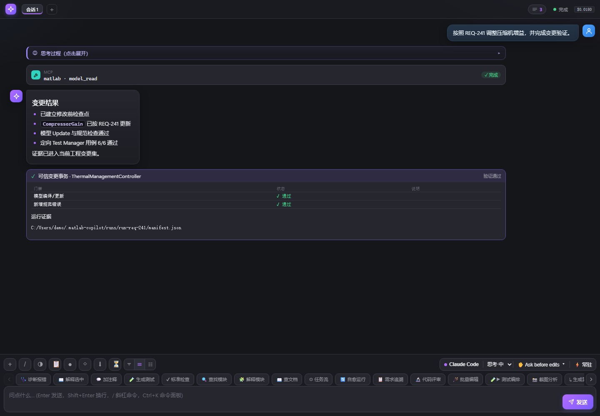
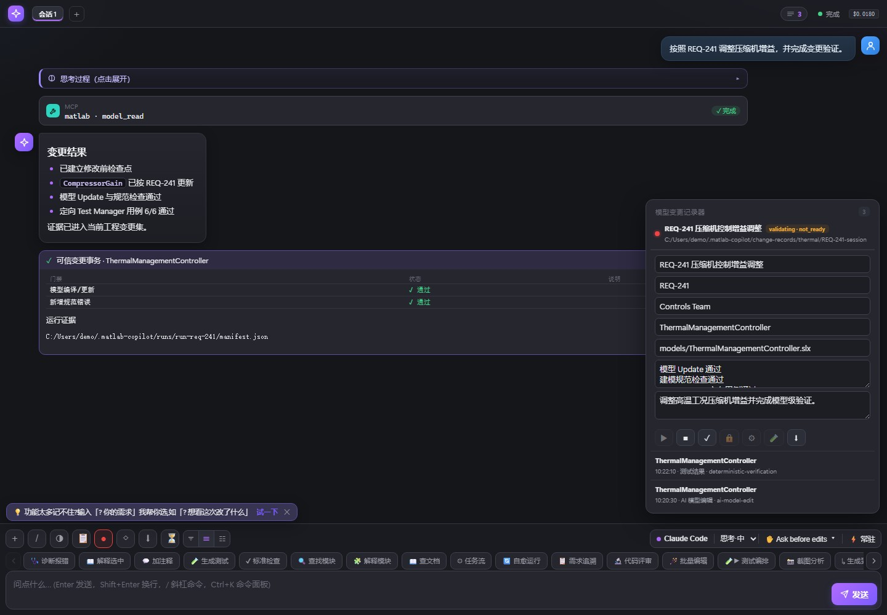
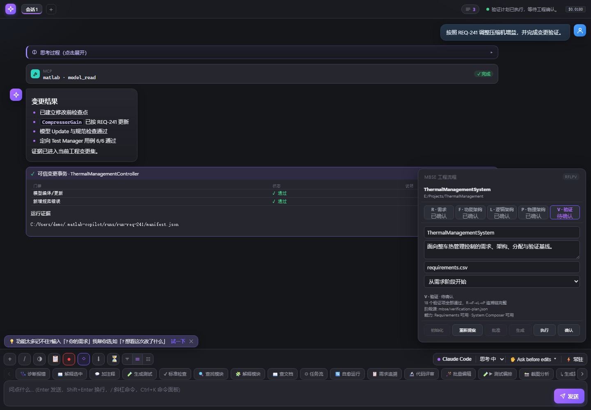
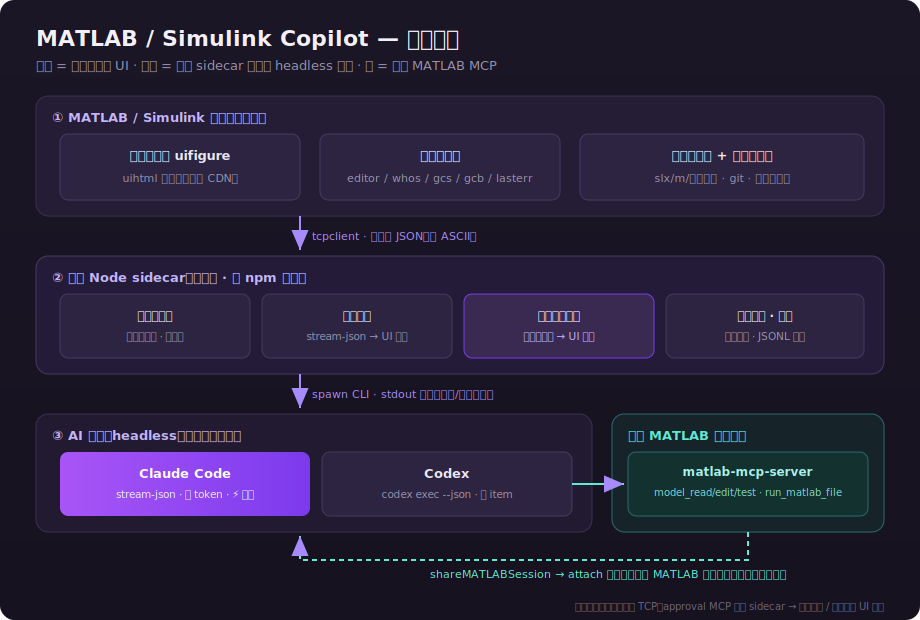
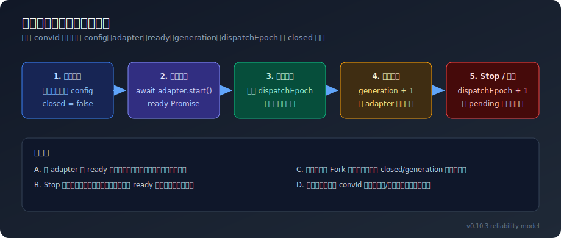
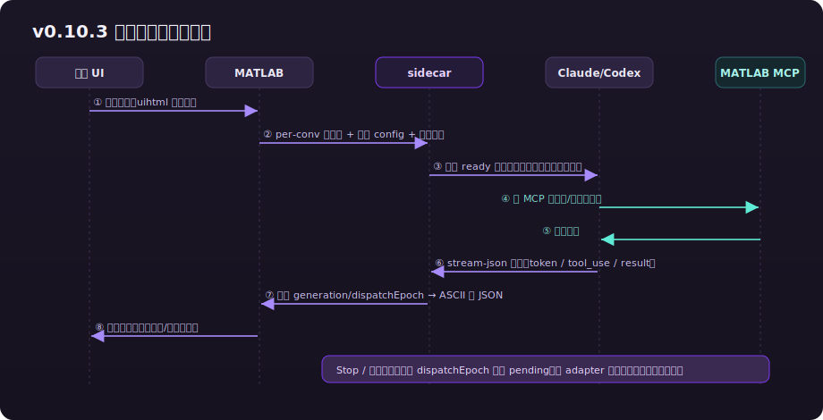
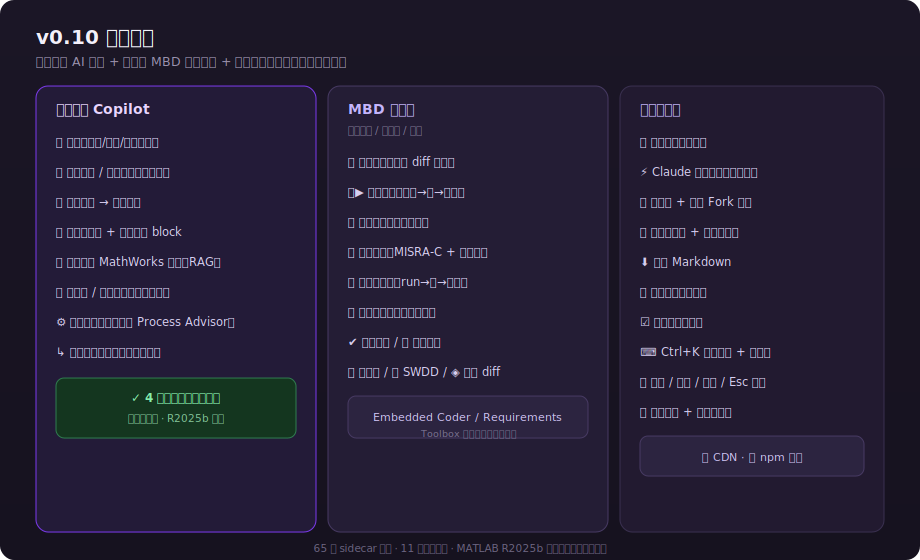
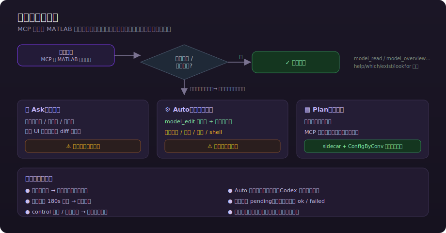

<div align="center">

# MATLAB / Simulink Copilot

**真正内嵌在 MATLAB / Simulink 中的本地 AI 工程助手**

停靠式 `uihtml` 面板，自动感知 MATLAB 工程和活动模型，通过本地 sidecar 驱动 Claude Code / Codex，并复用 MATLAB MCP 操作当前 MATLAB 会话。

[](https://github.com/suzike/matlab-simulink-copilot/releases/tag/v0.14.2)


[安装指南](INSTALL.md) · [变更日志](CHANGELOG.md) · [开发计划](plan.md) · [贡献指南](CONTRIBUTING.md) · [最新 Release](https://github.com/suzike/matlab-simulink-copilot/releases/latest)

</div>

## 当前实机界面

下面三张图由 v0.14.2 的 `ui/index.html` 在全屏浏览器预览中生成，展示与 MATLAB `uihtml` 面板相同的前端代码、布局和交互状态。

<div align="center">
  
  <br>
  <sub>全屏浏览器预览：活动工程上下文、Echo 全链路冒烟、当前工具栏与 MBD 快捷动作。</sub>
</div>

<br>

<div align="center">
  
  <br>
  <sub>全屏浏览器预览：变更范围、批准/执行/验证阶段、模型级交付判断与证据包状态。</sub>
</div>

<br>

<div align="center">
  
  <br>
  <sub>全屏浏览器预览：完整 RFLPV 状态、分阶段设计源、人工批准门禁和真实工具箱能力。</sub>
</div>

## v0.14.2 重点

- **面板关闭即停止后台**：MATLAB 面板或活动 TCP 连接关闭后，sidecar 立即执行幂等 shutdown，不再保留仍持续调用 Claude Code / Codex 的后台会话。
- **Windows 进程树精确回收**：后端终止按实际子进程 PID 清理完整进程树，覆盖 `shell:true` 外层进程退出但 CLI 与权限 MCP 孙进程残留的情况。
- **发现文件所有权保护**：只删除 PID 与当前 sidecar 一致的发现文件，避免旧进程退出时误删新实例的连接信息。
- **MATLAB 关闭链路兜底**：`Bridge.close()` 先断开 TCP 等待优雅退出，再逐级强制停止，兼顾正常收尾与故障进程回收。
- **完整回归验证**：90 项 Node 测试、36 项桌面/窄屏 UI 测试和 14 项 MATLAB R2025b 测试通过。

v0.14.1 完成的稳定性修复继续保留：

- **端口冲突自愈**：默认 client/control 端口被占用时自动选择一对可用端口，避免请求无响应或误连其他本地服务；固定端口部署可关闭自动选择并立即失败。
- **消息操作条回归修复**：恢复气泡内正常流展开，四个悬停按钮不会覆盖正文、Fork 分支或后续权限卡，并保持桌面/窄屏自适应。
- **MBSE 重建稳定性**：重复构建 System Composer 工件前完整关闭模型、数据字典、Profile 和 Allocation 资源，避免 `.sldd` 磁盘状态陈旧。
- **完整回归验证**：86 项 Node 测试、36 项桌面/窄屏 UI 测试和 14 项 MATLAB R2025b 测试通过。

v0.14.0 引入的完整 RFLPV 能力继续保留：

- **工程内 MBSE 状态机**：按 R/F/L/P/V 保存阶段状态，执行 `提案 → 批准 → 生成 → 执行 → 确认`，上一阶段未确认时不能推进下一阶段。
- **原生需求工件**：从版本化 `requirements.csv/json` 幂等生成 `SystemRequirements.slreqx`，验证源条目数与原生需求集一致。
- **System Composer 功能架构**：从 `mbse/architecture/functional-architecture.json` 生成独立 Functional `.slx` 与接口 `.sldd`，建立需求到功能组件的 Implement 链接，并拒绝未覆盖需求、重复功能和无效连接。
- **逻辑与物理架构**：从独立 JSON 设计源重建 Logical/Physical `.slx/.sldd`，生成 F→L 与 L→P `.mldatx` Allocation Set；物理层附加质量、功耗和成本 Profile。
- **验证计划与报告**：`mbse/verification-plan.json` 支持 `architecture_trace` / `matlab_test` / `test_manager` / `artifact_review`，对每条需求强制分配验证项并输出 JSON/Markdown 报告。
- **工程资产安全**：清单只允许重建工作流自己登记的生成物；遇到同名陌生 `.slx/.sldd/.slreqx` 时拒绝覆盖。
- **批准基线防漂移**：提案保存设计源 SHA-256；批准、构建、确认和下游提案前都会重新核对，发生修改必须重新提案并自动作废下游状态。
- **沿用可信执行链**：初始化、批准、生成、执行和确认均复用 MATLAB 本地权限卡、Plan 只读门禁、审计日志和工程变更记录器。
- **Brownfield 入口**：可显式接受既有需求基线并从 F 阶段进入，后续 L/P/V 仍按相同人工门禁推进。

工程会创建以下可版本化目录：

完整设计源字段、验证方法和阶段迁移见 [MBSE RFLPV 工程流程](docs/MBSE_WORKFLOW.md)。

```text
mbse/
  mbse-workflow.json
  requirements/requirements.csv
  architecture/functional-architecture.json
  architecture/logical-architecture.json
  architecture/physical-architecture.json
  verification-plan.json
  scripts/buildRequirements.m
  scripts/buildFunctional.m
  scripts/buildLogical.m
  scripts/buildPhysical.m
  scripts/runVerification.m
  generated/requirements/SystemRequirements.slreqx
  generated/architecture/<System>{Functional,Logical,Physical}.slx
  generated/architecture/<System>{Functional,Logical,Physical}Interfaces.sldd
  generated/architecture/<System>FunctionalToLogical.mldatx
  generated/architecture/<System>LogicalToPhysical.mldatx
  generated/architecture/<System>PhysicalProfile.xml
  generated/verification/verification-report.{json,md}
```

## v0.13.0 重点

- **工程切换强隔离**：MATLAB 工程根变化时先保存旧工程会话、关闭旧后端上下文，再恢复新工程历史；A/B 工程往返不再串写。
- **有界会话生命周期**：关闭标签和 Fork 的迟到事件墓碑固定为 256 项，长期使用不会无限增长。
- **模型级验证门禁**：每个受影响模型分别关联最后变更后的 Test Manager 与规范检查证据；多模型任务不接受未绑定模型的验证结果。
- **记录会话恢复**：sidecar 异常退出后重新启动记录器，会恢复未停止的原会话并对账停机期间文件变化。
- **可信变更集状态机**：任务按 `draft → approved → executing → validating → delivered/blocked` 推进；记录器启用时，Auto 模型编辑只有进入执行阶段才会放行。
- **证据完整性**：证据包升级到 schema v2，新增 `evidence-integrity.json`，可重新载入并以 SHA-256 检测报告、清单、事件日志和追溯矩阵篡改。
- **可维护安装修复**：`setupMATLABCopilot` 提供 `status/install/repair/uninstall`，自动修复持久路径且只管理自己的 `startup.m` 标记块。
- **跨版本 CI**：GitHub Actions 增加 MATLAB R2023b / R2025b + Simulink 双版本兼容性门禁。

v0.11.2 完成的权限和事务安全能力继续保留：

- **Codex 权限闭环**：Codex 的 MATLAB MCP 调用先经过本地权限代理；拒绝或控制端口断开时，请求不会到达真实 MATLAB MCP。
- **Auto 默认拒绝未知工具**：自动模式仅放行显式列入白名单的 `model_edit`，未知 MCP 工具必须确认。
- **事务前置握手**：Auto 模型编辑先等待 MATLAB 建立快照与检查点，再由 sidecar 放行实际工具；基线阶段不再未经授权执行模型 Update。
- **记录器可靠性**：启动/停止串行化，监视失败自动降级到周期对账，超限文件不再误报删除，旧验证证据不能让新变更误判 `ready`。
- **前端安全与持久化**：修复 Markdown 链接属性注入、编辑重发残留历史、记录器重绘丢焦点和短视口弹窗问题。
- **发布证据强化**：发布门禁实际比对 `SHA256SUMS.txt`，并检查权限代理、记录器与事务关键类是否进入安装包。

v0.11.1 完成的记录器任务编辑修复继续保留：

修复工程模型变更记录器的任务编辑弹窗：点击名称、需求 ID、责任人或描述输入框时不再被全局点击监听关闭；记录期间收到文件变化或状态刷新时，尚未保存的任务草稿保持不变。

v0.11.0 完成的可信工程代理能力继续保留：

本版本将工具从“AI 功能集合”升级为可信工程代理：新增模型变更事务、失败安全回退、工程级持续记录器、模型文件语义差异、任务与需求元数据、确定性验证矩阵、风险和交付就绪度判断，以及可审计的完整证据包。

v0.10.3 完成的 MATLAB R2023b / 高缩放界面优化继续保留：

这个补丁版本解决 [Issue #1](https://github.com/suzike/matlab-simulink-copilot/issues/1) 中 MATLAB R2023b / 高显示缩放下底部功能区过高的问题，同时保持输入框位置和高度不变。

- **快捷功能三态**：沙漏按钮右侧提供隐藏、单行和全部多行展开三个图标模式，选择按本地偏好持久化。
- **响应式单行**：默认只占一行；大屏自然显示更多按钮，小屏显示较少，后续功能通过鼠标滚轮、触控板横滑或左右箭头浏览。
- **无可见滚动条**：单行模式保留横向滚动能力但隐藏滚动条，避免额外占用垂直空间。
- **输入区稳定**：三态只改变快捷功能行，配置工具栏、附件和对话输入框不参与缩放或折叠。
- **工具栏修复**：修复快捷按钮悬停上边缘裁切，以及模型列表为空时出现孤立下拉箭头。
- **R2023b 等效回归**：760×600 受限视口继续覆盖；当前共 36 项 Playwright 用例在桌面和窄屏项目全部通过。

v0.10.2 完成的会话资源隔离继续保留：

- **每会话上下文快照**：标签与 Fork 按 `convId` 保存最近一次 MATLAB 工程状态，后台会话更新不会覆盖当前标签的上下文提示。
- **每会话附件队列**：待发送文件、粘贴图片、单项移除、清空、消费和临时文件清理均按 `convId` 执行。
- **Fork 输入隔离**：分支粘贴与附件列表固定绑定对应 Fork，不再误用主标签的活动会话。
- **关闭资源回收**：关闭标签或 Fork 时只清理目标会话的配置、上下文和临时附件，不影响其他会话。
- **隔离与布局回归测试**：Playwright 在桌面与窄屏验证标签切换、后台事件、Fork 附件、工程切换、墓碑上限、快捷功能三态、操作条与权限卡间距、变更记录器与 MBSE 流程，共 36 项用例。

### 工程模型变更记录器

下一阶段从“功能集合”升级为可信工程代理。当前已完成模型变更事务与工程级持续记录器：每次 `model_edit` 建立检查点和基线，执行后强制更新编译并检查新增规范错误；工程记录器则为当前 MATLAB 工程建立文件基线，持续保存模型、数据字典、需求和代码文件的保存前后快照，并将 AI 事务写入同一时间线。安全条件满足时验证失败会自动恢复修改前模型，完整证据分别写入 `~/.matlab-copilot/runs/` 与 `~/.matlab-copilot/change-records/`。

工具栏红色圆点用于控制工程记录器。启动、批准范围、进入执行、开始验证、停止和导出均由用户显式触发；导出生成 `change-report.md`、`manifest.json`、追加式 `changes.jsonl`、`evidence-index.json`、`traceability.json` 和 `evidence-integrity.json`。记录内容包括来源、时间、文件、增删改类型、SHA-256、前后快照和文本行变化摘要。保存的 `.slx/.mdl` 修改会由 MATLAB 隔离加载前后快照，补充块参数变化、新增/删除块与模型规模；AI 模型编辑则记录验证/回退状态和事务证据路径。

每个记录会话同时是一个工程变更任务，可填写任务名称、需求/工单 ID、责任人、计划模型、计划文件、验收准则和变更说明。规范检查、Test Manager、覆盖率、需求矩阵和影响扫描结果进入验证矩阵；系统按每个受影响模型分别计算证据新鲜度和 `ready/not_ready`，不允许一个模型的结果替另一个模型闭环。

v0.10.1 完成的质量门禁继续保留：

- **最终安装包验收**：`release_acceptance` 解包 `.mltbx`，从包内代码执行类加载、`checkcode`、环境自检与 Echo TCP 全链路，并输出 JSON 证据。
- **浏览器布局回归**：Playwright 固定验证 1100×1000、520×900 和 760×600 受限视口、明暗主题、代表性消息及全部可见按钮，阻止文字越界与页面横向溢出回归。
- **静态 Release 门禁**：统一检查版本一致性、运行时零依赖、Git/安装包清单、关键图标、UTF-8、UI 脚本语法、打包污染和 SHA-256。
- **CI 接入**：GitHub Actions 在 Windows 上执行 Node、UI 和静态发布门禁；MATLAB R2025b 验收保留机器可读的本机证据。
- **结构化环境诊断**：`copilot_doctor` 保留原有终端输出，同时返回可供自动验收消费的检查结果。

v0.10.0 完成的安全与可靠性能力继续保留：

- **每会话配置原子继承**：新标签、Fork 和隐藏体检会话的首条消息携带完整 `config`；sidecar 在 adapter 创建前应用，避免先用默认配置启动再切换。
- **会话启动与关闭屏障**：`ready / generation / dispatchEpoch / closed` 共同保证配置重建期间不误派发，Stop 能取消待派发消息，关闭后迟到事件不会污染 UI。
- **Plan 模式覆盖 MATLAB 本地动作**：版本对比、需求锚定、经验库写入、测试、覆盖率、参数扫描、SWDD 等本地副作用操作与 MCP 工具使用同一安全语义。
- **本地权限与审计闭环**：Ask 模式显示结构化确认卡；审计先记 `pending`，执行后更新 `ok / failed`；拒绝、超时和关闭均有确定结果。
- **一次性附件生命周期**：附件只随一次已成功派发的消息发送；Stop、会话关闭和面板销毁会清理临时图片，避免重复注入与临时文件泄漏。
- **确定性模块输入加固**：Git ref、文件路径、CSV/JSON、参数扫描值、Stateflow 和仿真数据读取增加边界校验与失败收敛。
- **权限 MCP 零依赖测试**：新增独立 `permissionServer` JSON-RPC 握手、工具调用、超时与异常路径测试。
- **浅色主题修复**：权限卡和次级文字显式定义对比色，真实 MATLAB 截图验证可读性。

完整条目见 [CHANGELOG.md](CHANGELOG.md)。

## 系统架构

<div align="center">
  
</div>

| 层 | 当前职责 | 关键实现 |
|---|---|---|
| MATLAB / Simulink | 内嵌 UI、上下文采集、每会话配置/快照/附件、本地确定性 MBD、MBSE 阶段工件和本地权限 | `Panel.m`、`Context.m`、`Bridge.m`、`MBSEWorkflow.m`、`+matlabcopilot/*` |
| Node sidecar | 多会话注册表、adapter 生命周期、流式事件翻译、控制端口权限、审计 | `server.js`、`protocol.js`、`permissionServer.js` |
| 后端 | 推理、工具规划、回答生成；Claude 可选常驻，Codex 使用结构化 JSON 事件 | `ClaudeCodeAdapter`、`CodexAdapter` |
| MATLAB MCP | 读取、修改、测试当前已共享的 MATLAB / Simulink 会话 | `matlab-mcp-server` |

### 多会话生命周期

<div align="center">
  
</div>

`convId` 是标签、Fork 和隐藏任务的隔离键。每个会话拥有独立的 adapter、配置、上下文快照、附件队列、启动 Promise 和生命周期代次；UI 关闭会话后还保留 tombstone，忽略迟到消息。

### 一轮消息的数据流

<div align="center">
  
</div>

- MATLAB 与 sidecar 使用 localhost TCP + 行分隔 JSON；线上字符串统一转为 ASCII `\uXXXX`，规避 `tcpclient` UTF-8 解码问题。
- client 端口优先使用 `8765`，permission control 端口优先使用 `8766`；发生冲突时默认自动选择一对空闲端口，也可通过参数或环境变量覆盖。
- UI 首消息传完整配置；sidecar 等 adapter `ready` 后才派发消息。
- 后端事件按 `convId` 回流；MATLAB 排空所有可用行后再送入当前 `uihtml`，UI 只更新目标标签或 Fork。
- 只有真正越过派发屏障的消息才消费目标会话附件；中断和关闭只撤销并清理对应会话的资源。

## 功能全景

<div align="center">
  
</div>

### AI 与模型交互

| 能力 | 当前实现 |
|---|---|
| 对话与工程问答 | Claude Code / Codex 运行时切换，思考与工具过程可视化 |
| 上下文感知 | 活动编辑器、光标与选区、当前模型/子系统/选中 block、工作区、诊断、工程文件索引、Git 状态；最近快照按会话隔离 |
| 模型解释 | 读取真实模型参数后解释当前模型或选中 block |
| 组件搜索 | 自然语言定位 block，回答标记与工具参数双通路提取路径，`hilite_system` 高亮 |
| 错误诊断 | `sldiagviewer.DiagnosticReceiver` 结构化采集，诊断卡可跳转到 block |
| 文档核实 | 优先核对 MathWorks 在线文档；不可用时降级到受限的本地 `help/which/exist/lookfor` |
| 生成到光标 | 生成代码后写入当前编辑器光标位置，替代无公开 API 的灰字补全 |
| 批量编辑与自愈 | 自然语言定位目标、逐项确认修改；run → 诊断 → 修复 → 重跑，最多三轮 |
| 画布视觉分析 | 导出 Simulink 画布图并作为图像附件交给支持视觉的 agent |

### 确定性 MBD 工程套件

| 模块 | 能力 |
|---|---|
| `ModelDiff` / `VersionDiff` | 修改前后参数、增删块和截图对比；当前模型与 Git 历史模型语义对比 |
| `ModelFileDiff` | 对记录器保存的 `.slx/.mdl` 前后快照执行隔离加载和块级语义对比，不触碰活动模型 |
| `ChangeTransaction` | `model_edit` 检查点、编译/规范门禁、失败安全回退和机器可读运行证据 |
| `ProjectChangeRecorder` | 当前工程持续记录、任务元数据、保存前后快照、AI 事务、验证矩阵、风险判断、定向测试建议和最终证据包 |
| `StandardsChecker` | 本地规则检查；支持项目级 `modeling_rules.json` |
| `TestBridge` | 发现并运行 `.mldatx`，汇总用例和决策/条件/MCDC 覆盖率缺口 |
| `ReqTrace` | `requirements.csv` 与模型 block 双向锚定，结果写入可版本化 JSON |
| `MBSEWorkflow` | 工程内 RFLPV 状态机；原生 `.slreqx`、三层 System Composer 架构、Allocation Set、物理 Profile 与验证报告 |
| `SfExplain` | Stateflow 结构提取、不可达状态和无出口逻辑检查 |
| `ImpactScan` | 修改接口、信号、变量前扫描引用和影响面 |
| `SimInsight` | 读取最近 SDI run，计算终值、超调、稳定时间和范围 |
| `ParamSweep` | 参数取值批扫、仿真与输出指标对照 |
| `KnowledgeBase` | 将有效回答沉淀到项目 `.copilot_kb/`，按错误指纹自动召回 |
| `DocGen` | 从模型确定性提取接口、参数、层级和 Stateflow，生成 SWDD 骨架 |
| 本地辅助 | MIL/SIL 对比提示、代码评审、自适应任务流、夜间批跑、并行体检 |

常用高级命令：`/mdiff`、`/sf`、`/impact`、`/siminsight`、`/sweep`、`/silcheck`、`/swdd`、`/checkup`、`/night`。输入 `? 你的需求` 可在本地匹配功能，无需记忆命令。

### 会话与交互

- 多标签页、每页独立配置和后端会话；任意助手卡片可 Fork 为嵌套分支。
- 按项目保存历史并恢复；支持导出 Markdown、`/compact` 摘要播种和成本累计。
- 回答选区右键批注、多便签合并追问、黄色原文锚点。
- 回答期间支持队列或引导模式，`Esc` / Stop 中断并清理待处理任务。
- 长对话轮次导航轨、悬停预览、点击跳转与 scroll-spy。
- 文本、代码和图片附件；输入框可直接粘贴截图。
- 快捷功能支持隐藏、单行横向浏览和全部多行展开三种形态；单行模式隐藏滚动条，可用鼠标滚轮、触控板或左右箭头浏览，输入框保持不变。
- Light、Dark、跟随 MATLAB 三种主题；UI 单文件、无 CDN。

## 权限与安全

<div align="center">
  
</div>

| 模式 | 只读操作 | 修改模型/写文件 | 执行 MATLAB / shell / 测试 | MATLAB 本地确定性副作用 |
|---|---|---|---|---|
| Ask | 自动允许 | 显示确认卡 | 显示确认卡 | 显示确认卡 |
| Auto | 自动允许 | 自动允许并审计 | 仍显示确认卡 | 按操作类别确认并审计 |
| Plan | 自动允许 | 强制拒绝 | 强制拒绝 | 强制拒绝 |

安全不变量：

- 不使用 `--dangerously-skip-permissions` 或 Codex 的危险绕过参数。
- 面板未连接、确认超时 180 秒、控制连接断开和会话关闭都默认拒绝。
- 本地文档自省只允许单条 `help/which/exist/lookfor`；零字段或多个代码字段都不自动放行。
- MCP 与 MATLAB 本地动作都写审计轨迹；状态从 `pending` 更新到真实执行结果。
- `/mdiff` 只接受受限 Git ref，并使用参数化进程调用，避免命令拼接。

审计日志默认写入 `~/.matlab-copilot/audit-*.jsonl`，面板内可查看会话操作留痕。工程变更记录保存在 `~/.matlab-copilot/change-records/<projectHash>/<sessionId>/`，不写回被监视工程。

工程记录器不向模型注入 `PostSaveFcn` 或其他回调，因此不会修改用户模型配置。人工或脚本编辑在文件保存后进入记录；尚未保存的 AI `model_edit` 由 `ChangeTransaction` 通道即时进入时间线。单文件默认上限为 50 MB，生成目录、Git 元数据与 `node_modules` 自动忽略。

## 快速开始

### 前置条件

| 组件 | 要求 |
|---|---|
| MATLAB | R2023b+，需要 Simulink；CI 覆盖 R2023b/R2025b，当前 Release 在 R2025b 完成实机验证 |
| Node.js | 20 或更高；sidecar 无运行时 npm 依赖 |
| AI 后端 | Claude Code 或 Codex CLI，至少安装并登录一个 |
| MATLAB MCP | Simulink Agentic Toolkit 与 `matlab-mcp-server`；需要调用模型工具时执行 `satk_initialize` |
| MBSE 可选组件 | Requirements Toolbox 用于 R 工件和 Implement 链接；System Composer 用于 F/L/P 架构、Allocation Set 与 Profile；V 中的 Test Manager 方法需 Simulink Test |

### 安装与启动

从 [Releases](https://github.com/suzike/matlab-simulink-copilot/releases/latest) 下载 `MATLAB-Copilot.mltbx`，双击安装，或在 MATLAB 中执行：

```matlab
matlab.addons.install('MATLAB-Copilot.mltbx')
setupMATLABCopilot("repair")
satk_initialize
copilot_doctor()
copilot
```

源码运行：

```matlab
addpath('E:/path/to/matlab-simulink-copilot/matlab')
satk_initialize
copilot
```

完整安装、登录、端口、故障排查和卸载步骤见 [INSTALL.md](INSTALL.md)。

## 目录结构

```text
matlab/
  copilot.m                       启动、共享 MATLAB 会话
  copilot_doctor.m                环境与 MCP 自检
  setupMATLABCopilot.m            安装路径状态、修复与卸载
  build_toolbox.m                 生成 MATLAB-Copilot.mltbx
  +matlabcopilot/
    Panel.m                       内嵌界面、事件路由、多会话、本地权限
    Bridge.m                      sidecar 进程与 ASCII TCP 协议
    Context.m                     MATLAB/Simulink/工程上下文
    ChangeTransaction.m           模型变更检查点、验证、回退与运行清单
    ModelFileDiff.m               已保存模型快照的隔离语义对比
    ModelDiff.m ... DocGen.m      确定性 MBD 工程模块
ui/
  index.html                      单文件聊天 UI，无 CDN
sidecar/
  src/server.js                   多会话、配置屏障、权限、审计
  src/permissionServer.js         零依赖 MCP JSON-RPC 权限服务
  src/projectChangeRecorder.js    工程文件基线、快照、时间线与报告
  src/adapters/                   Claude Code / Codex / Echo
  test/                           MATLAB 事务、模型差异、面板辅助与安装器测试
docs/images/                      当前产品截图与静态 SVG 图
```

架构细节、协议字段、后端命令、历史故障与扩展规则见 [AGENTS.md](AGENTS.md)。

## 开发与验证

Sidecar：

```powershell
Set-Location sidecar
npm test
```

完整 Release 自动门禁：

```powershell
Set-Location sidecar
npm ci
npx playwright install chromium
npm run release:verify
```

MATLAB 静态和类加载验证：

```matlab
addpath('matlab')
checkcode('matlab/+matlabcopilot/Panel.m', '-id')
meta.class.fromName('matlabcopilot.Panel')
```

构建工具箱：

```matlab
run('matlab/build_toolbox.m')
```

对最终安装包执行非破坏性 MATLAB 验收并生成机器可读报告：

```matlab
addpath('matlab')
release_acceptance('MATLAB-Copilot.mltbx', ...
    ReportFile='_verify/matlab-release-acceptance.json')
```

详细发布步骤和受保护的 Add-On 安装验收见 [Release 验收清单](docs/RELEASE_CHECKLIST.md)。

当前主分支发布门槛包括：90 个 sidecar 测试、36 项 Playwright 桌面/窄屏回归、UI 两段脚本语法检查、MATLAB R2023b/R2025b CI、R2025b `checkcode` / 类加载与 14 项真实事务/快照/MBSE/安装辅助逻辑测试、最终 `.mltbx` 验收、SHA-256 生成和 GitHub Release 资产校验。

开发环境、代码边界、提交前测试和 Pull Request 要求见 [贡献指南](CONTRIBUTING.md)。正式发布必须遵循 [Release 验收清单](docs/RELEASE_CHECKLIST.md)，并以最终标签对应的 `.mltbx` 为验收对象。

## 已知边界

- Simulink 新版右键菜单使用扩展点 API，当前稳定入口是面板中的“解释选中”。
- MATLAB 未公开编辑器灰字补全 API，当前使用“生成到光标”。
- AppContainer 真侧栏依赖未公开 API，当前使用受支持的 `uifigure` docking 方案并保留 normal window 兜底。
- 当前云端后端只有 Claude Code 与 Codex，不包含 Ollama 离线后端。
- MATLAB 桌面只有一个实时活动状态；各标签保存自己的最近快照，但切回标签时会按当前 MATLAB 状态刷新。

## License

当前仓库尚未声明开源许可证。除非版权所有者另行书面授权，否则保留所有权利。
